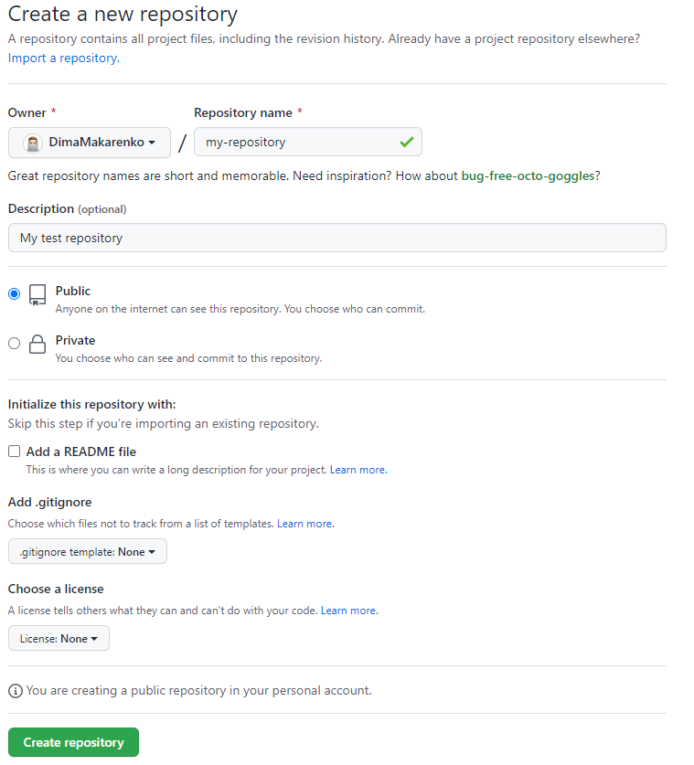
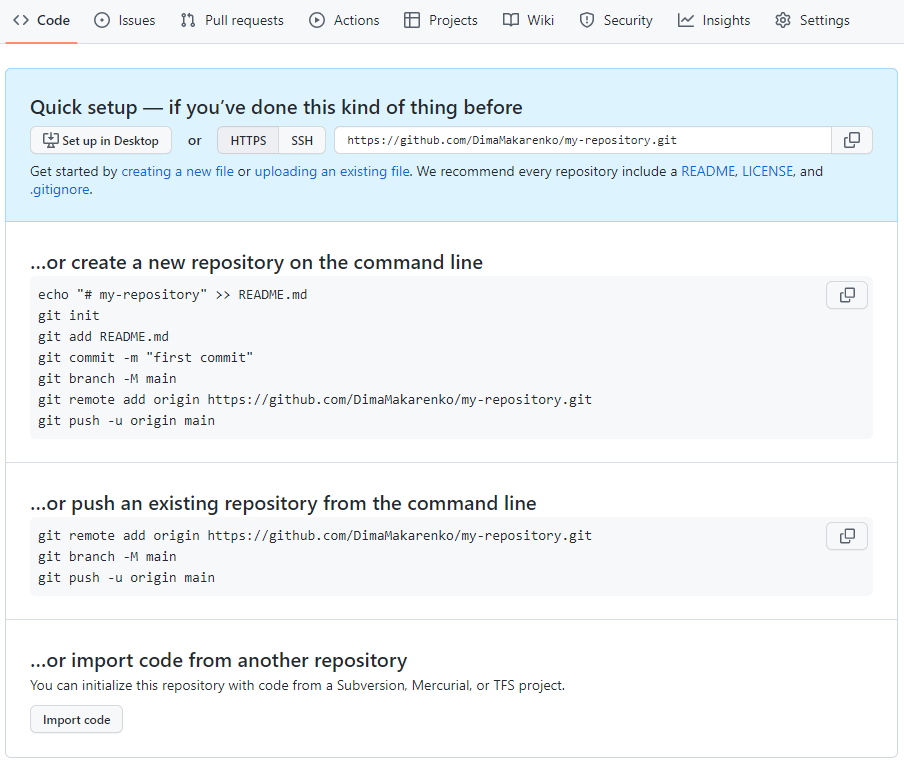

# Як користуватись GitHub Pages?

## Підготовка

### Базова установка Github

1. Перш за все потрібно [встановити Git](https://git-scm.com/downloads) на свій комп'ютер. Це базове програмне забезпечення для керування версіями, поверх якого працює GitHub.
2. [Створити обліковий запис в GitHub](https://github.com/).
3. Якщо ніколи раніше не використовували git, для початку вам необхідно здійснити установку. Виконайте наступні команди, щоб git дізнався про ваше ім'я та електронну пошту. Замініть ```Your Name``` на ім'я користувача та ```your_email@some.com``` на електронну адресу з якою реєструвались в системі GitHub.

```
git config --global user.name "Your Name"
git config --global user.email "your_email@some.com"
```

## Створення репозиторію для коду

1. Потім потрібно створити новий репозиторій для файлів. Натисніть «Плюс» (+) у верхньому правому кутку головної сторінки GitHub і виберіть «Новий репозиторій» (New Repository).
2. На цій сторінці введіть ім'я для свого репозиторія, наприклад ```my-repository```, у полі «Ім'я репозиторію» (Repository name).
3. Також можна додати опис, щоб уточнити, що міститиме репозиторій. Ваш екран має виглядати так:



4. Натисніть "Створити репозиторій" (Create repository) відкриється наступна сторінка:



## Завантаження файлів на GitHub


### Створення нового репозиторію

Команди для створення нового репозиторію показані в блоці ```…or create a new repository on the command line```. Більше детально про ці команди:

- ```git init``` - Команда створює нове сховище Git. Його можна використовувати для перетворення існуючого проекту без версії в сховище Git або ініціалізації нового порожнього сховища. Більшість інших команд Git недоступні за межами ініціалізованого сховища, тому це зазвичай перша команда, яку ви запускаєте в новому проекті.
- ```git add .``` - бере змінені та нові файли у вашому робочому каталозі та розміщує змінені версії в робочій області.
- ```git commit -m "first commit"```:
  - ```commit``` - це моментальний знімок поточних змін проекту. Зафіксовані знімки можна розглядати як безпечні версії проекту. Кожен коміт містить покажчик на своє кореневе дерево, що представляє стан робочого каталогу на той момент.
  - ```m``` - встановлює повідомлення коміту. Обов’язково надайте стислий опис, який допоможе вашим товаришам по команді (і вам самим) зрозуміти, що сталося.
  - ```"first commit"``` - текст коміту, де можна надати короткий опис, що змінилось або що будо додано.

  Підсумуємо, дана команда створює знімок поточних файлів, (*які ми додали до робочої області за допомоги команди ```git add```*), та додає опис цього коміту (*в даному випадку **first commit***).
  
- ```git remote add origin https://github.com/{your-name}/${your-repository}.git``` - використовується для створення запису про нове підключення до віддаленого репозиторію.

- ```git push -u origin master```:
  - ``push`` - використовується для завантаження вмісту локального репозиторію у віддалений репозиторій.
  - ``-u`` - Виконавши команду ```git push -u origin master```, ви встановлюєте зв'язок між тією гілкою, в якій ви знаходитесь і гілкою master на віддаленому сервері. Команду потрібно виконати один раз, щоб потім можна було відправляти/приймати зміни лише виконуючи ```git push``` з гілки без вказівки будь-яких аліасів для сервера та віддалених гілок. Це зроблено для зручності.
  - ```origin``` - це скорочене ім'я віддаленого репозиторію, з якого спочатку був клонований проект. Точніше, він використовується замість URL вихідної репозиторію, що значно спрощує звернення до нього.
  - ```master``` - назва гілки в яку буде завантажено код.

Після цього весь код буде завантажено до віддаленого репозиторію на GitHub.

## Підключення GitHub Pages.

1. Щоб зробити це, зайдіть на сторінку свого репозиторію і виберіть "**Налаштування**" (*Settings*)
2. Виберіть "**Сторінки**" (*Pages*) на панелі зліва. 
3. У розділі "**Гілки**" (*Branch*), для першого випадаючого списку "**None**" виберіть назву гілки з якої буде побудована ваша сторінка. Зазвичай це гілки master або main. Далі потрібно натиснути кнопку "**Зберегти**" (*Save*). Сторінка має оновитися.
4. Після деякого часу, зазвичай до хвилини, з'явиться текст з повідомленням, що ваш сайт працює за адресою "https://xxxxxx"
5. Якщо ви натисните на посилання, вам має відкритися сторінка з живою демонстрацією вашого прикладу, за умови, що домашня сторінка називається **index.html** - за умовчанням посилання веде саме на неї. Якщо точка входу на ваш сайт називається якось інакше, наприклад, ```myPage.html```, то щоб побачити її, вам потрібно відкрити "https://xxxxxx/myPage.html".

