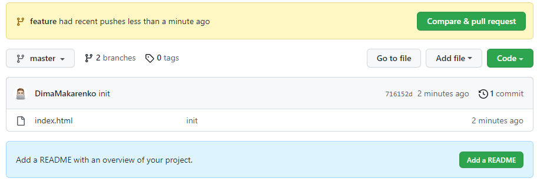
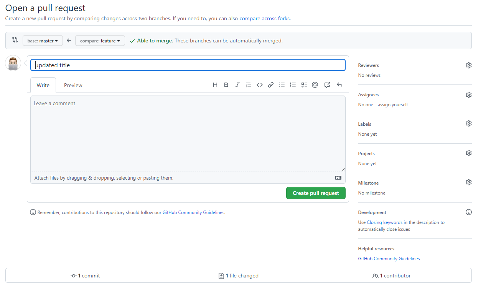
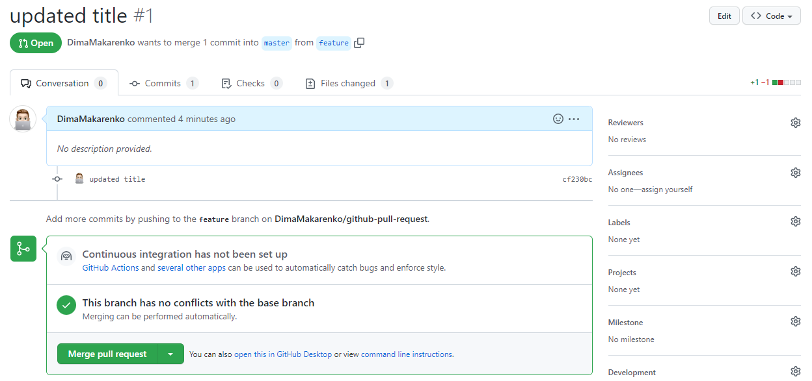
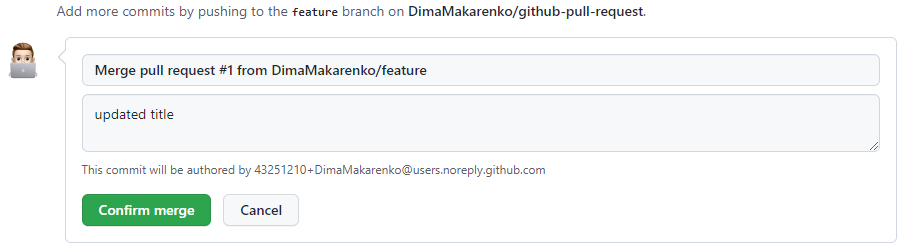
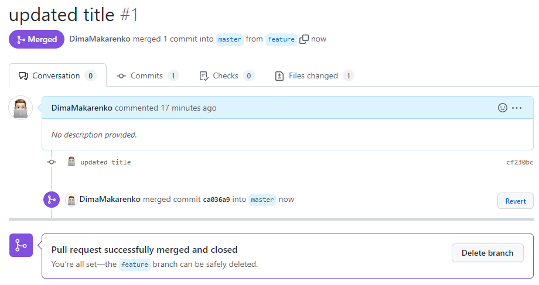

# Як користуватись GitHub Pull Request?

## Створення нової гілки для GitHub Pull Request

Під час процесу Pull Request відбувається об'єднання однієї гілки (*branch*) з іншою. Допустимо, ви зараз знаходитесь у гілці ```master``` і хочете вести розробку в окремій гілці, наприклад ```feature```. Для цього потрібно створити нову гілку та перемкнутися на неї. 

- ```git branch feature``` - команда створює нову гілку з назвою ```feature```.
  - ```branch``` - команда дозволяє створювати, перераховувати, перейменовувати та видаляти гілки. Це не дозволяє вам перемикатися між гілками або знову збирати розгалужену історію.
  - ```feature``` - назва гілки в якій буде вестись розробка.

Після створення гілки потрібно перемкнутися на неї.

- ```git checkout feature``` - перемикає розробку на гілку ```feature```
  - ```checkout``` - команда для перемикання поточної активної гілки, але її також можна використовувати для відновлення файлів.
  - ```feature``` - назва гілки в якій буде вестись розробка.

Далі можна вести розробку у новій гілці і додавати нові комміти зі змінами.
Для давання змін використовуються команди ```git add .``` та ```git commit -m "feature"```

Для додавання поточної лігки до віддаленого репозиторію потрібно виконати наступну команду:

- ```git push -u origin feature```:
  - ``push`` - використовується для завантаження вмісту локального репозиторію у віддалений репозиторій.
  - ``-u`` - Виконавши команду ```git push -u origin feature```, ви встановлюєте зв'язок між тією гілкою, в якій ви знаходитесь і гілкою master на віддаленому сервері. Команду потрібно виконати один раз, щоб потім можна було відправляти/приймати зміни лише виконуючи ```git push``` з гілки без вказівки будь-яких аліасів для сервера та віддалених гілок. Це зроблено для зручності.
  - ```origin``` - це скорочене ім'я віддаленого репозиторію, з якого спочатку був клонований проект. Точніше, він використовується замість URL вихідної репозиторію, що значно спрощує звернення до нього.
  - ```feature``` - назва гілки в яку буде завантажено код.


> Для перевірки назви гілки можна виконати команду ```git status```. Ця команда виведе текст в якому буде сказано: ```On branch ${branch-name}```.

Після цього, через декілька секунд, можливо хвилин, зміни будеть доступні в GitHub.


## Створення Pull request на сервісі Github

### Автоматичне створення

Після додавання нової гілки до віддаленого репозиторію Github може з'явитись така спливаюча підказка з текстом, що гілка була нещодавно додана. Для створення нового Pull Request потрібно натиснути 
**«Порівняйти та витягнути запит»** (*Compare & pull request*). 
*



Після натискання з'явиться нова сторіка з налаштуванням Pull request. На сторінці налаштування відображена інформація про гілки, які будуть автоматично поєднані. У даному випадку це ```base: master <- compare: feature```. Тобто, зміни з гілки ```feature``` будуть додані до робочої гілки ```master```.

Також, для Pull request можна змінити заголовок та додати коментарі за бажанням.

> Заголовок є обов'язковим для створення нового Pull Request.



Для створення Pull Request потрібно натиснути **«Створити запит на витягнення»** (*Create pull request*). Після натисканя відкриється нова сторінка з уже створеним Pull Request.




## Злиття робочих гілок (Merge pull request)

Для злиття/додавання змін до робочої гілки (у даному випадку до гілки ```master```) потрібно написнути **«Злиття pull request»** (*Merge pull request*). Після натискання на кнопку з'явиться блок з підтвердженням дії злиття. Для цього потрібно натиснути **«Підтвердити злиття»** (*Confirm merge*).



Після цього усі коміти з цієї гілки буде додано до базової гілки за допомогою коміту злиття.



## Оновлення змін для локальних гілок

Після злиття змін за допомогою Pull Request, робоча гілка (для цього випадку **master**) була доповнена/оновлена змінами з іншої гілки. Процес злиття відбувався для віддаленого репозиторію. Локальний репозиторій поки не знаю про ці зміни. Для цього потрібно перемкнутися на робочу гілку (**master**): ```git checkout master``` та підтянути зміни з локального репозиторію.
- ```git pull``` - команда використовується для отримання та завантаження вмісту з віддаленого сховища та негайного оновлення локального сховища відповідно до цього вмісту.
